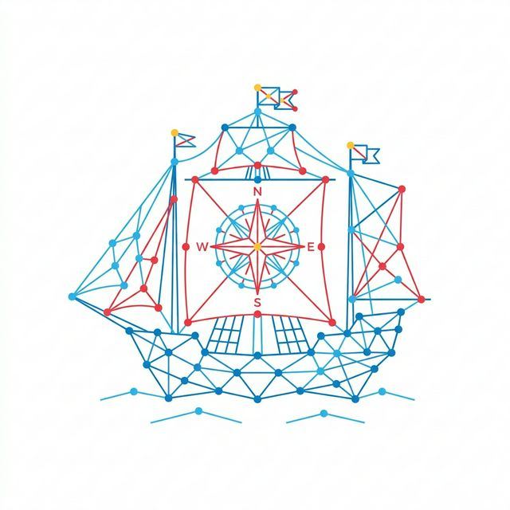

# Magellan

<p align="center">
  
</p>

Enterprise knowledge discovery and process repository. Point Magellan at a folder
of collected materials — code, documents, meeting transcripts, API specs, diagrams
— and it builds a structured, queryable knowledge graph organized by business
domain. Contradictions and open questions are surfaced as primary outputs, not
side effects.

Then use the knowledge graph to research, plan, and execute work with full
context at every stage.

## Quick Start

```bash
# Plugin install (recommended for Claude)
/plugin marketplace add apardawala/ai-navigator
/plugin install magellan@apardawala

# Manual install (Claude Code)
git clone https://github.com/apardawala/ai-navigator.git && cd ai-navigator/magellan && ./install.sh

# Install for Gemini / AntiGravity
git clone https://github.com/apardawala/ai-navigator.git && cd ai-navigator/magellan && ./install-gemini.sh

# Install for Kiro IDE
git clone https://github.com/apardawala/ai-navigator.git && cd ai-navigator/magellan && ./install-kiro.sh
```

```text
/magellan                              Run the discovery pipeline
/magellan:add /path/to/document.pdf    Add a file or directory
/magellan:add --codebase /path/to/repo Analyze a live codebase
/magellan:add --correction "..."       Record a verbal correction
/magellan:add --resolve c_001 "..."    Resolve a contradiction
/magellan:add --resolve oq_003 "..."   Answer an open question
/magellan:ask How does billing work?   Query the knowledge graph
/magellan:work "Add payment API"       Structured SDLC workflow
/magellan:research "market trends"     External research with citations
/magellan:research --from-kg           Auto-generate research topics from KG

*(For Gemini, the slash commands use hyphens instead of colons: `/magellan-add`, `/magellan-ask`, `/magellan-work`, `/magellan-research`.)*
```

## What You Get

```text
.magellan/
  summary.md                       ← Compressed KG overview for session start
  onboarding_guide.md              ← Briefing for new team members
  onboarding_guide.html            ← Interactive version (opens in browser)
  graph.html                       ← Interactive KG explorer (vis.js, opens in browser)
  contradictions_dashboard.md      ← Contradictions & open questions (the priority)
  contradictions_dashboard.html    ← Print-friendly version
  log.md                           ← Activity log (append-only, one line per event)
  diagrams/                        ← C4 architecture diagrams (Mermaid + PlantUML)

  silver/                             ← Text extracts from source documents (kreuzberg)
    <path>/<file>.txt              ← Plain text extract
    <path>/<file>.index.json       ← Section index for targeted reading

  audit/
    processing_manifest.json       ← Per-file provenance (hash, tool, timestamps)
    session_log.jsonl              ← Every processing action with rationale
    methodology.md                 ← Process description for independent audit

  domains/<domain>/
    facts/                         ← Atomic facts from source documents
    entities/                      ← One file per knowledge graph entity
    relationships.json             ← How entities connect within this domain
    summary.json                   ← Plain language domain narrative
    contradictions.json            ← What disagrees
    open_questions.json            ← What's unknown
    deliverables/                  ← Business rules, DDD specs, API specs, contracts

  codebase/                        ← Structural analysis (from --codebase)
    STACK.md                       ← Languages, frameworks, dependencies
    ARCHITECTURE.md                ← Patterns, boundaries, data flow
    CONVENTIONS.md                 ← Naming, style, idioms
    INTEGRATIONS.md                ← External APIs, databases, 3rd parties
    CONCERNS.md                    ← Tech debt, complexity hotspots, risks

  research/                        ← External research reports (not in the KG)
    <topic>.md                     ← One report per research topic

  work/                            ← SDLC work items
    <slug>/
      status.md                    ← Current phase
      analysis.md → context.md → tasks.md → estimate.md →
      execution.md → verification.md → audit.md
```

## Three Phases

The pipeline runs with quality gates after every step:

**Phase 1 — Discovery**: Read files → extract atomic facts → build entities and
relationships → detect contradictions → link across domains → summarize each
domain → generate onboarding guide (markdown + interactive HTML), dashboard,
C4 diagrams, and interactive graph explorer.

**Phase 2 — Design**: Formalize business rules (HARD / SOFT / QUESTIONABLE) →
generate DDD specs → implementation contracts → export rules as DMN, JSON, CSV,
Gherkin → generate OpenAPI and AsyncAPI specs.

**Phase 3 — Research** (optional): Auto-generate research topics from the KG →
research customer sentiment, competitor analysis, integration alternatives, and
industry trends → produce cited reports for human review.

Every fact traces to a source document with an exact quote. Nothing is invented.
On subsequent runs, only files with changed content are reprocessed (SHA-256
content hashing).

## Medallion Data Architecture

Magellan organizes data into three layers:

- **Bronze** — Raw source files. Can be local files or URL references (via a
  manifest with content hashes). Magellan never reads bronze during analysis.
- **Silver** — Text extracts in `.magellan/silver/`. Produced by kreuzberg
  extraction. All fact extraction reads from silver only.
- **Gold** — The knowledge graph in `.magellan/domains/`. Built exclusively
  from silver data.

This separation means source documents don't need to live in your repository.
A URL manifest with content hashes is sufficient — Magellan fetches, extracts
to silver, and discards the original. The silver layer is lightweight text that
can be committed to git without bloating the repo.

## Silver Indexer

Large documents (5,000+ lines) waste context when read entirely during fact
extraction. The silver indexer (`tools/silver-indexer.py`) analyzes each text
extract and produces a sidecar `.index.json` with:

- **Boilerplate detection** — Repeated lines (headers, footers, watermarks)
- **Section boundaries** — Parsed from structural patterns in the text
- **Content classification** — TOC, glossary, narrative, structured list, data
- **Density scoring** — Signal words (shall, must, within N days) scored per
  section to identify high-value content

```bash
python3 tools/silver-indexer.py --dir .magellan/silver/
```

During fact extraction, the pipeline reads the index first and targets only
`high` and `medium` density sections. In testing across 140 government policy
documents, this reduced reading by 32% with no loss of business rule coverage.

The indexer is fully generic — no domain-specific patterns. It works on any
kreuzberg text extract.

## SDLC Workflow

After building the knowledge graph, use `/magellan:work` to plan and execute
work with KG context at every stage:

1. **Analyze** — Surface relevant entities, contradictions, and dependencies
2. **Discuss** — Resolve open questions and gray areas before committing
3. **Plan** — Create atomic task plans with KG-derived acceptance criteria
4. **Estimate** — Blast radius, pre-mortem, and risk assessment
5. **Execute** — Implement with atomic commits per task
6. **Verify** — Evidence-based verification against acceptance criteria
7. **Audit** — Integration check and feed learnings back to the KG

Each phase produces a reviewable markdown artifact. The user reviews and approves
before the next phase runs. All artifacts are committed to git — any new session
can pick up where the last one left off.

## Codebase Analysis

Use `/magellan:add --codebase <path>` to analyze a live codebase alongside your
documents. Magellan extracts structural understanding (tech stack, architecture,
conventions, integrations, concerns) and cross-references it with document-derived
knowledge. Code that contradicts documentation surfaces as contradictions
automatically.

## Input Files

Magellan reads anything Claude can read — text, code, markdown, CSV, JSON, YAML,
XML, PDF, images, and meeting transcripts.

> **Note:** Claude does not yet natively read DOCX, PPTX, or XLSX files. Until
> it does, convert these to PDF before adding them to your workspace.

Includes 12 language guides for legacy systems (RPG, COBOL, CL, DDS, JCL, CICS,
Assembler/370, NATURAL/ADABAS, IDMS, Easytrieve, PL/I, REXX) that improve
extraction precision. Add your own for proprietary languages.

## Model Recommendations

- **`/magellan` full pipeline** — Use Opus. Contradiction detection and
  cross-domain linking require strong reasoning.
- **`/magellan:add` single file** — Sonnet is sufficient for fact extraction.
- **`/magellan:ask` simple lookups** — Sonnet handles factual and overview queries.
- **`/magellan:ask` cross-domain traversals** — Use Opus for multi-hop graph
  walks and complex structural queries.

## Installation

### Plugin install (Claude Code, recommended)

From within Claude Code:

```bash
/plugin marketplace add apardawala/ai-navigator
/plugin install magellan@apardawala
```

### Manual install (Claude Code)

```bash
git clone https://github.com/apardawala/ai-navigator.git
cd ai-navigator/magellan
./install.sh
```

This copies skills, commands, and the statusline hook to `~/.claude/`.
Both methods require only Claude Code. Restart Claude Code after installing.

> **Note:** The statusline hook (`scripts/statusline.js`) shows Magellan pipeline
> progress and KG metrics in your Claude Code status bar. The manual install
> copies it automatically. For plugin installs, the pipeline will install it
> on first run. To install manually: `cp scripts/statusline.js ~/.claude/hooks/`

### Gemini / AntiGravity Install

```bash
git clone https://github.com/apardawala/ai-navigator.git
cd ai-navigator/magellan
chmod +x install-gemini.sh
./install-gemini.sh
```

This script copies workflows and skills into `.agent/workflows/` and `.agent/skills/` within your current workspace directory, rewriting the internal instructions to adapt Claude commands to Gemini workflows on the fly.

### Kiro IDE Install

```bash
git clone https://github.com/apardawala/ai-navigator.git
cd ai-navigator/magellan
chmod +x install-kiro.sh
./install-kiro.sh
```

This script converts Magellan skills into Kiro steering files at `.kiro/steering/`
with appropriate inclusion modes (Always for principles, Auto for skills, Manual
for slash commands). Tools install to `.magellan-tools/` in the workspace.
Use `/magellan-add`, `/magellan-ask`, `/magellan-work`, `/magellan-research` in Kiro.

## Contributing

- **Skills**: Add or improve domain expertise in `skills/`
- **Language guides**: Add guides for new languages in `skills/ingestion/language_guides/`
- **Feature requests**: Open an issue

Apache 2.0 license.
