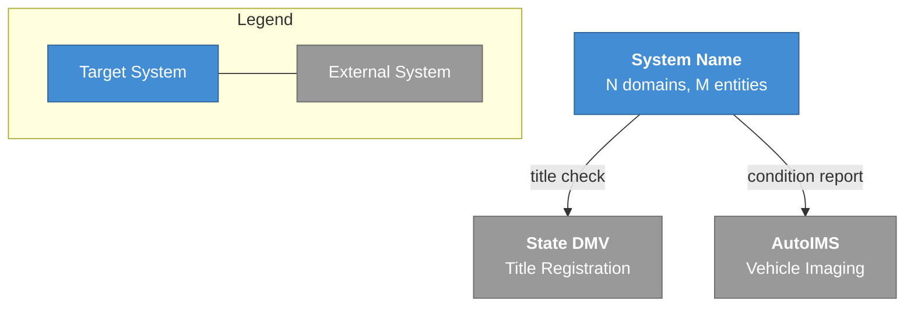
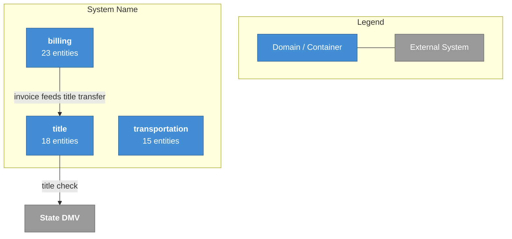
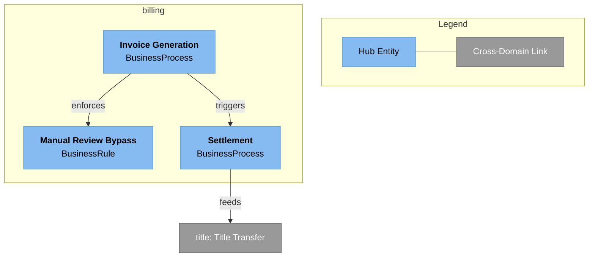

# C4 Architecture Diagram Generation

You produce C4 model diagrams at three levels from the knowledge graph. Each level
is generated as both Mermaid (`.mmd`) and PlantUML (`.puml`) files.

These diagrams give architects a visual overview of the system landscape, domain
boundaries, and key components — directly from the KG data, not hand-drawn.

## Output Directory

All diagrams go in `.magellan/diagrams/`:

```
.magellan/diagrams/
  context.mmd              Level 1 — System Context (Mermaid)
  context.puml             Level 1 — System Context (PlantUML)
  containers.mmd           Level 2 — Container (Mermaid)
  containers.puml          Level 2 — Container (PlantUML)
  components_billing.mmd   Level 3 — Component per domain (Mermaid)
  components_billing.puml  Level 3 — Component per domain (PlantUML)
  components_title.mmd     ...one pair per domain
  components_title.puml
```

## When to Generate

- After the contradictions dashboard in a full pipeline run (Phase 1)
- Again after Phase 2 regeneration of the dashboard (to capture new relationships)
- On demand when an architect requests a diagram refresh

## Process

### Level 1 — System Context

Produces `context.mmd` and `context.puml`.

1. Use Glob on `.magellan/domains/*/` to discover all domain names.
2. For each domain, use the Read tool to read `.magellan/domains/<domain>/summary.json` —
   collect domain names and entity counts. Sum entity counts for the total.
3. Use the Read tool to read `.magellan/cross_domain.json` — get all cross-domain edges.
4. From cross-domain edges and domain summaries, identify external systems:
   entities of type `Integration` or `Infrastructure` that represent systems
   outside the target platform (e.g., "State DMV", "AutoIMS", "SAP").
   Also check hub_summaries across domains for integration-type entities.
5. Generate the diagram:
   - The target system as one box containing all domains (show domain count
     and total entity count).
   - External systems/actors as separate nodes around the target system.
   - Arrows between the target system and external systems, labeled with
     the integration purpose from edge descriptions.
   - A legend explaining node shapes and styles.
   - A generation timestamp as a comment.

### Level 2 — Container

Produces `containers.mmd` and `containers.puml`.

1. Use Glob on `.magellan/domains/*/` to discover domains, then Read each
   domain's `.magellan/domains/<domain>/summary.json` — get domain names,
   entity counts, narratives.
2. Use the Read tool to read `.magellan/cross_domain.json` — get inter-domain
   edges and external integrations.
3. Generate the diagram:
   - Each domain as a container node (show entity count).
   - Cross-domain edges as labeled arrows between domains. Use the edge
     `description` from properties as the arrow label.
   - External integrations at the boundary (same external systems from Level 1).
   - Mermaid `click` events on domain nodes linking to their summary.json:
     `click DOMAIN_ID "domains/<domain>/summary.json"`
   - A legend explaining node types and edge meanings.
   - A generation timestamp as a comment.

### Level 3 — Component (per domain)

Produces `components_<domain>.mmd` and `components_<domain>.puml` for each domain.

1. Use the Read tool to read `.magellan/domains/<domain>/summary.json` for the
   domain — get `hub_summaries` array. These are the hub entities (most connected,
   highest weighted) for the domain.
2. Use the Read tool to read `.magellan/domains/<domain>/relationships.json` for
   the domain — get intra-domain edges.
3. Use the Read tool to read `.magellan/cross_domain.json` — find edges that touch
   this domain (entry points from other domains, exit points to other domains).
4. Generate the diagram:
   - **Hub entities only** as nodes within the domain subgraph. Use the entity
     name and type from hub_summaries. Do NOT include every entity — only hubs.
   - Intra-domain edges between hub entities as labeled arrows. Filter
     relationships.json to only include edges where both `from` and `to` are
     hub entities.
   - Cross-domain entry/exit points as separate nodes outside the subgraph,
     labeled with the other domain name and entity name.
   - Mermaid `click` events on entity nodes linking to their entity JSON:
     `click ENTITY_ID "domains/<domain>/entities/<entity_id>.json"`
   - A note: "Showing hub entities only. Full entity list in KG."
   - A legend and generation timestamp.

## Mermaid Output Format

### Level 1 — System Context (`context.mmd`)



### Level 2 — Container (`containers.mmd`)



### Level 3 — Component (`components_<domain>.mmd`)



## PlantUML Output Format

Use C4-PlantUML syntax with the standard library includes.

### Level 1 — System Context (`context.puml`)

```plantuml
@startuml
!include https://raw.githubusercontent.com/plantuml-stdlib/C4-PlantUML/master/C4_Context.puml

title System Context — System Name
footer Generated: 2026-02-23T10:00:00Z

System(SYSTEM, "System Name", "N domains, M entities")

System_Ext(EXT_DMV, "State DMV", "Title Registration")
System_Ext(EXT_AUTOIMS, "AutoIMS", "Vehicle Imaging")

Rel(SYSTEM, EXT_DMV, "title check")
Rel(SYSTEM, EXT_AUTOIMS, "condition report")

SHOW_LEGEND()
@enduml
```

### Level 2 — Container (`containers.puml`)

```plantuml
@startuml
!include https://raw.githubusercontent.com/plantuml-stdlib/C4-PlantUML/master/C4_Container.puml

title Container — System Name
footer Generated: 2026-02-23T10:00:00Z

System_Boundary(SYSTEM, "System Name") {
    Container(BILLING, "billing", "Domain", "23 entities")
    Container(TITLE, "title", "Domain", "18 entities")
    Container(TRANSPORT, "transportation", "Domain", "15 entities")
}

System_Ext(EXT_DMV, "State DMV")

Rel(BILLING, TITLE, "invoice feeds title transfer")
Rel(TITLE, EXT_DMV, "title check")

SHOW_LEGEND()
@enduml
```

### Level 3 — Component (`components_<domain>.puml`)

```plantuml
@startuml
!include https://raw.githubusercontent.com/plantuml-stdlib/C4-PlantUML/master/C4_Component.puml

title Component — billing
footer Generated: 2026-02-23T10:00:00Z\nShowing hub entities only. Full entity list in KG.

Container_Boundary(BILLING, "billing") {
    Component(INV_GEN, "Invoice Generation", "BusinessProcess")
    Component(MAN_REV, "Manual Review Bypass", "BusinessRule")
    Component(SETTLE, "Settlement", "BusinessProcess")
}

System_Ext(TITLE_TRANSFER, "title: Title Transfer")

Rel(INV_GEN, MAN_REV, "enforces")
Rel(INV_GEN, SETTLE, "triggers")
Rel(SETTLE, TITLE_TRANSFER, "feeds")

SHOW_LEGEND()
@enduml
```

## Node ID Generation

Generate valid Mermaid/PlantUML node IDs from entity IDs:

1. Take the entity_id (e.g., `billing:invoice_generation`).
2. Remove the domain prefix and colon.
3. Convert to UPPER_SNAKE_CASE (e.g., `INVOICE_GENERATION`).
4. For cross-domain references, prefix with the domain in uppercase
   (e.g., `TITLE__TITLE_TRANSFER` for `title:title_transfer`).

Ensure all node IDs are unique within each diagram.

## Identifying External Systems

External systems are entities that represent integrations with systems outside
the target platform. Identify them by:

1. Entity type: `Integration`, `ExternalSystem`, or `Infrastructure`
2. Tags: `external_integration`, `third_party`, `external_system`
3. Cross-domain edges where one side references a system not in any domain
4. Hub summaries that mention external dependencies

If no clear external systems are found, omit them from Level 1 rather than
guessing. The diagram should only contain what the KG proves.

## Handling Edge Cases

- **Single domain**: Level 1 shows the system with no internal arrows.
  Level 2 has one container. Skip cross-domain arrows.
- **No external systems found**: Level 1 shows just the target system box.
  Add a note: "No external integrations identified in KG."
- **Domain with no hub entities**: Skip Level 3 for that domain. Log:
  "Skipping component diagram for <domain>: no hub entities in summary."
- **Empty cross_domain.json**: Level 2 shows domains without arrows between
  them. Add a note: "No cross-domain relationships identified."

## Writing the Files

Write diagram files using the Write tool (same pattern as onboarding_guide.md
and contradictions_dashboard.md — these are generated text artifacts, not KG data).

Create the `.magellan/diagrams/` directory if it doesn't exist.

Write each file immediately after generating it. Do not accumulate all diagrams
in memory before writing.

## Critical Rules

- ALL data reads MUST use Claude's built-in tools:
  - **Discover domains**: Glob on `.magellan/domains/*/`
  - **Read domain summaries**: Read tool on `.magellan/domains/<domain>/summary.json`
  - **Read cross-domain edges**: Read tool on `.magellan/cross_domain.json`
  - **Read relationships**: Read tool on `.magellan/domains/<domain>/relationships.json`
  - **Discover entities**: Glob on `.magellan/domains/<domain>/entities/*.json`
  - **Read entity details**: Read tool on `.magellan/domains/<domain>/entities/<entity_id>.json`
- Only include hub entities in Level 3 diagrams. The hub_summaries array from
  the domain summary is the source of truth for which entities to show.
- Every arrow label must come from KG data (edge descriptions, relationship types).
  Never invent relationship labels.
- Every click link must point to an actual file path in the `.magellan/` structure.
- Include a legend in every diagram.
- Include a generation timestamp as a comment in every diagram.
- Write files using the Write tool — diagrams are generated artifacts like the
  onboarding guide, not KG data.

## What You Do NOT Do

- Do not invent entities, relationships, or external systems. Only diagram what
  the KG contains.
- Do not include all entities in Level 3. Hub entities only.
- Do not generate Level 4 (diff diagrams). That is deferred.
- Do not generate image files. Output is text (Mermaid/PlantUML) that renders
  in GitHub, VS Code, Confluence, or dedicated viewers.
- Do not skip the legend or timestamp. Every diagram must be self-documenting.
- Do not use Bash or shell commands to create directories. Use the Write tool
  which creates parent directories automatically.
